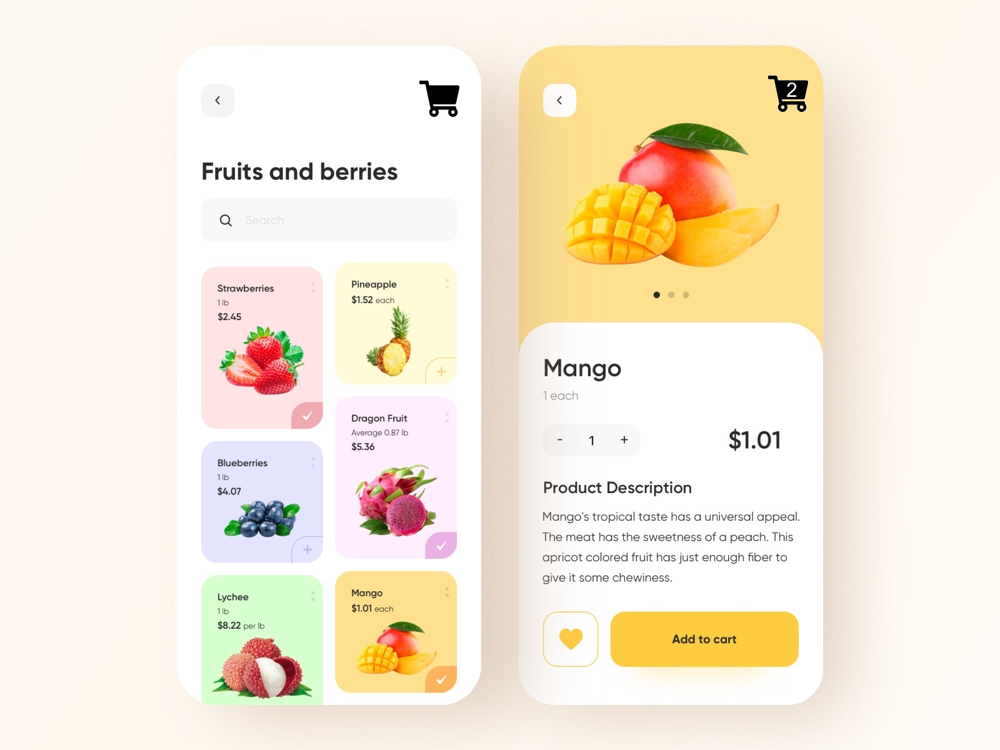

# Deine Aufgabe
Baue einen rudimentären Shop mit einer Produktlistenseite, einer Produktdetailseite und einem Warenkorb.

## Folgende Funktionen sollen enthalten sein:

- Das Suchfeld soll funktionieren. Man kann nach bestimmten Fruchtnamen suchen, die Liste von Früchten wird mit jedem veränderten Buchstaben laufend angepasst (ab dem ersten Buchstaben).

- Oben rechts wird ein Warenkorb angezeigt mit einer Nummer, die zeigt, wie viele Produkte gerade im Warenkorb liegen (Beispiel: 2 Äpfel + 3 Bananen = 5).

- Wenn ein Produkt im Warenkorb liegt, wird in der Produktliste unten rechts am Produkt ein Haken angezeigt.

- Jedes Produkt hat eine eigene Unterseite, auf der man das Produkt in den Warenkorb legen kann. Wenn man ein Produkt hinzufügt, das schon im Warenkorb liegt, wird dessen Menge entsprechend erhöht.
 

## Weitere Hinweise zur Bearbeitung der Aufgabe:

- Du musst dich nicht genau ans Layout halten, denn der Fokus dieser Aufgabe liegt auf der Umsetzung der Funktionen.

- Wir haben für dich ein JSON File mit Produktdaten und Bildern vorbereitet, aus dem du alle Infos ziehen kannst (die Preise sind in Cent angegeben).

- Eine Standard-React Installation ist bereits vorbereitet (weitere Infos in Readme.react.md). Du kannst direkt loslegen!

- Bitte mach regelmäßig commits und pushe am Ende alles in dein Repo.

## Das gewünschte Layout:
 
